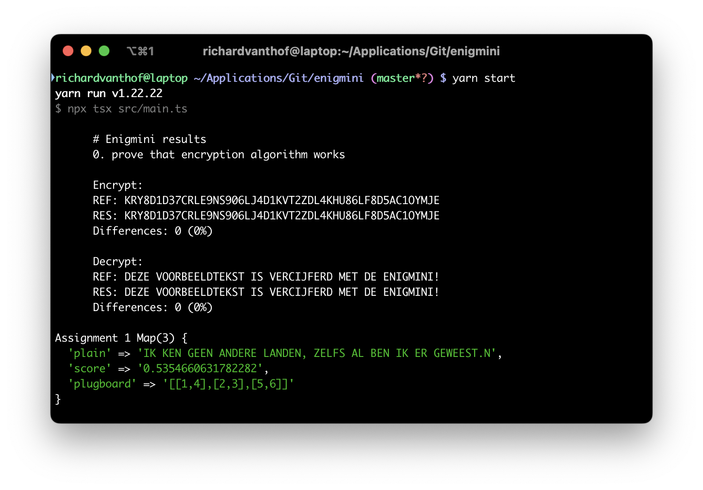

# Enigmini cracker



As a programming exercise I tried to solve an assignment from the 2024 AIVD Kerstpuzzel (Chrismas puzzle) where I had to implement an Enigma-like encryption algorithm and use it to crack some cyphers. This was a nice challange to play with simple encryption and combinatronics in Node.js.

- [View instructions (Dutch)](src/assets/KP2024+final+1.02.jpg)

## 🚀 Get started

#### Instructions


1. Clone this repo.
2. Install depencies: `yarn install`.
3. Run script: `yarn start`

## 👾 Commands

- `yarn install`
  Install depencencies.

- `yarn start`
  Run script

- `yarn test`
  Run unit tests.

## 📄 Assignments
1. Given is the same configuration as the [example](src/assets/KP2024+final+1.02.jpg) but the plugboard is different. Give the title: `UCXOMDTVHMAXJCO6PKSJJ5P4Y18EMYUO2KOGDM31QXT31SEV8JH116`.
```
The resulting plain text is `IK KEN GEEN ANDERE LANDEN, ZELFS AL BEN IK ER GEWEEST.`
which is a lyric from a song with the title 'Liefs uit London.'

Therefore the answer is 'Liefs uit London.'
```
2. Given is the same configuration as assignment 1 but the rotors and reflectors are different. Give the title: `0ULW2BHR3SJALF5P2FWCYONLHPFW7YZN84UPQWNKMTYIEYTYN2QE63SJBLFV6SQE9Y27E2`
4. Given is the same configuration as assignment 2, but the keymap is different. The plugboard is empty. Give the title:
```
7RBNG4ACEK83YHUZLODARRHEZ3WT8URC4EC3XAQR448CW7NZK434K977B36D7ZEZRBU6PKCCXDSUC4E6QXZ7FZRVYOCEJK3N8AOTEUR44O6Q6AJH4UZ4ONAB8RUEGHEAZPULMBO7RBIQUTKW78JJCWMKWOCSH6O73YONBV644CEDABR44CDYLR7HUUEC2XS6HIU7L03NBRLJ3CCUP
```

4. The Enigmini has been reconfigured using a new reflector and keymap and also two new rotors. The plugboard is empty. What can't be missing in this assignment? And what's the answer to the question?
```plaintext
## Answer format:
Answer#1: ...
Answer#2: ...
Commentary: ...
```

## 🗂️ Project structure

- `src/assignments/`: contain the assignments.
- `src/classes/`: contain components for encyryption algorithm
- `src/data/`: contains Dutch sample text for scoring if a string on likelyhood of containing Dutch.
- `src/analysis`: contains functions for bruteforcing the algorithm aka.:
  -  Looping through all settings (aka. the findSettings functions)
  -  Generating all versions of a certain setting ('generate functions)
  -  Evaluating if a certain setting is correct and if the output contains natural language (aka. fitness functions).
    - currently doing this using ngrams and wordlists   
